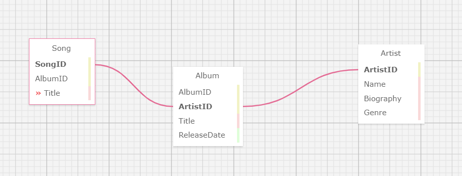

# sdi-2026-knex-workshop
This project will evaluate your ability to create a PostgreSQL database that can be connected to using an Express server. The goal of this checkpoint is not to finish quickly, but rather to do the best you can so we can gauge where everyone in the class is at and how well you're absorbing the material. Take your time and don't stress out!

By the end of this Workshop, you will be able to:

- Build schemas and entity relationship diagrams using data definition language (DDL)
- Create and connect to databases using connection strings
- Compose sql queries using data modification language (DML) in order to 
  insert, delete, modify, and update data
- Connect an express API to an existing database

## Project Instructions
  **Project Specs**

This week's workshop will be more free-form to give you the freedom to create datasets as you see fit. As long as the requirements below are met, your database entries and API endpoints can be comprised of whatever you wish.

- API must contain endpoints that cover all CRUD functionality
   - Must contain parameterized endpoints or endpoints that handle query 
     parameters

- Your repo should contain your ERD in some form - including it as an image that you can show in the README.md is a superb way to achieve this!
    - Feel free to use any schema design tool to come up with your ERD - here's 
      one lightweight tool you might use

      

- PostgreSQL database must be maintained and interacted with using Knex.js
    - Must seed initial data into database using Knex
    - Must retrieve data from the database using the join method of Knex

### Stretch Goals

- Make data structures stored in database more complex to increase lookup times. Increase initial seed data amount by an exponential scale (i.e. from 100 entires to 1,000,000). Use the morgan middleware to add rudimentary metrics logging for your API requests and check lookup time performance after bloating data. Look into ways to improve performance (hint - start with indexing).

- Create a straightforward front-end to display the data coming back from your API.

- Send an HTTP request to a 3rd party API to seed your database. Transform the resultant data into the format you want for your database prior to insertion.
